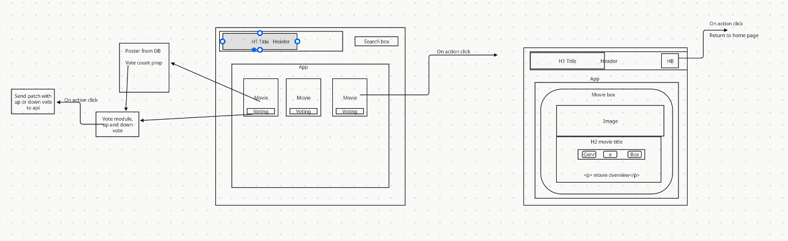

# Rancid Tomatillos

## Description
Rancid Tomatillos is a movie information app that allows users to explore popular movies, view detailed information about each movie, and vote for their favorites. The app includes features such as:
- A homepage displaying movie posters and titles.
- A detailed view of each movie, showing genres, an overview, and more.
- A functional search bar for live filtering of movies by title.
- Voting functionality for users to upvote or downvote movies.

The app is built using React and leverages React Router for navigation. It consumes data from a backend API to fetch movie details and updates.
The work on the project was completed over the course of 8 days.

## How to Use

1. Visit the deployed site: [Rancid Tomatillos](https://lustrous-mochi-8ef560.netlify.app/).
2. Browse the homepage to see a selection of movies.
3. Click on a movie poster to view detailed information about the selected movie.
4. Use the voting buttons to upvote or downvote movies.
5. Navigate back to the homepage by clicking the "Home" button in the header.

## Approaches to Building
- **Component-Driven Development**: The app is structured with reusable components like `MoviesContainer`, `MovieDetails`, and `App` to improve manageability and scalability.
- **React Router**: Implemented for seamless navigation between pages, ensuring a dynamic and user-friendly experience.
- **API Integration**: Data is fetched from a backend API, enabling real-time updates and a responsive voting system.
- **Testing**: End-to-end testing with Cypress ensures the app functions correctly and meets user stories.

## Links
- **Deployed Application**: [Rancid Tomatillos Live Site](https://lustrous-mochi-8ef560.netlify.app/)
- **GitHub Repository**: [Rancid Tomatillos Repository](https://github.com/sethverrill/rancid-tomatillos)
- **GitHub Project Board**: [Project Board](https://github.com/users/sethverrill/projects/3)

## Architecture

## Team Members
#### Jeremiah Ross
- [LinkedIn Profile](https://www.linkedin.com/in/jeremiahross/)
- [GitHub Profile](https://github.com/crosswolfv1)

#### Seth Verrill
- [LinkedIn Profile](https://www.linkedin.com/in/sethverrill)
- [GitHub Profile](https://github.com/sethverrill)
